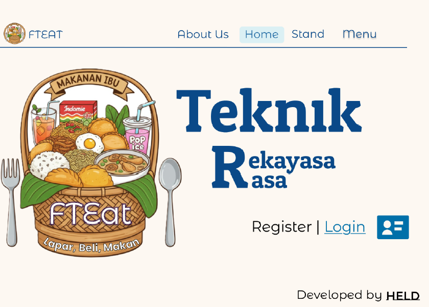
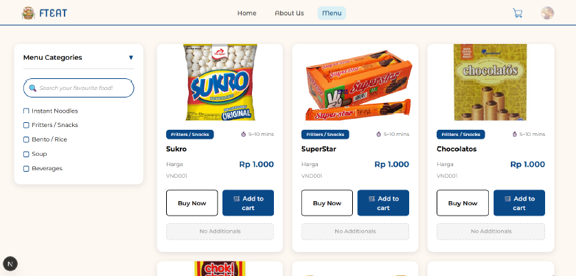
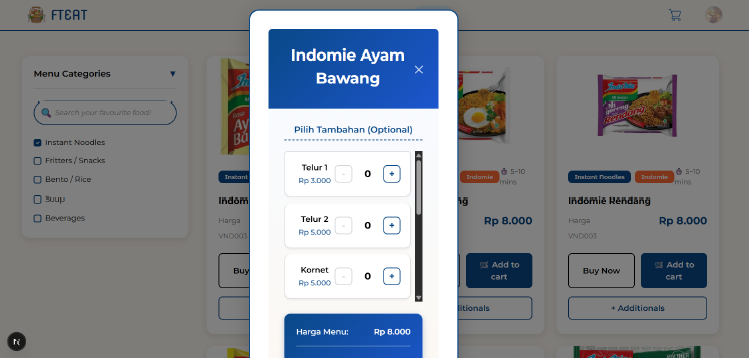
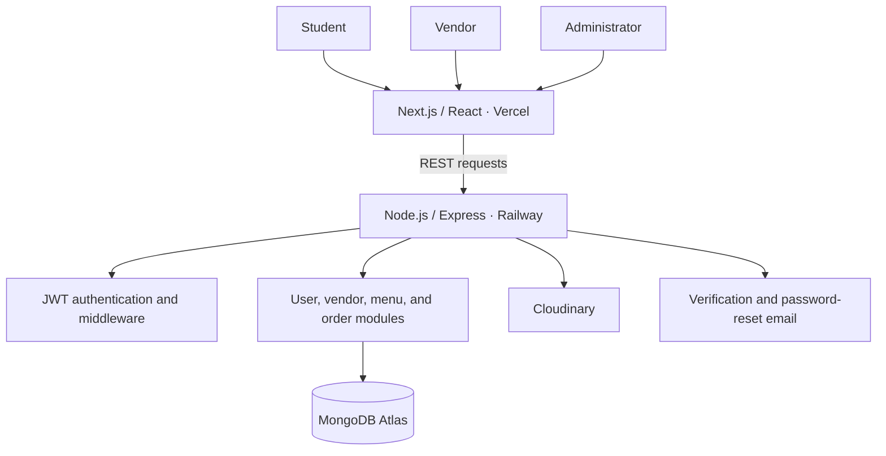
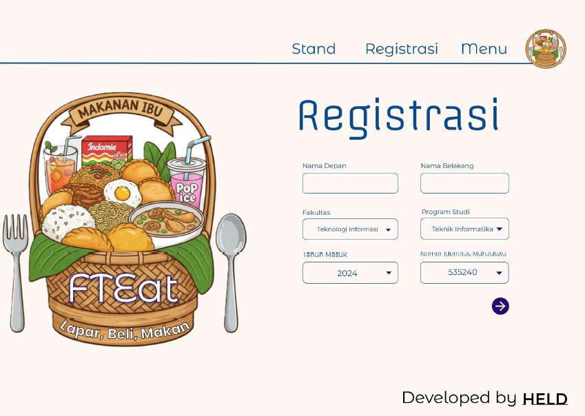
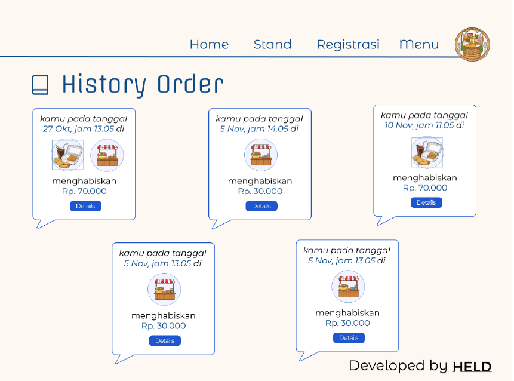
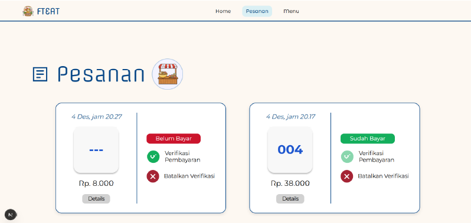
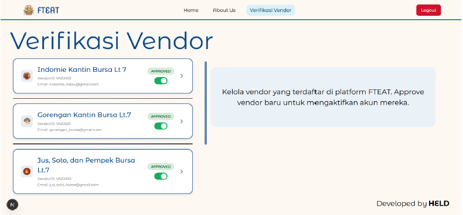

# FTEAT — Campus Food Ordering Platform

**A web platform for students, food vendors, and canteen administrators at Universitas Tarumanagara.**

FTEAT (*Teknik Rekayasa Rasa*) brings menu discovery, ordering, payment confirmation, and vendor operations into one application for the 7th-floor Engineering canteen. Built as a four-person academic final project in 2025, it combines a Next.js interface with an Express API and MongoDB persistence.

**My role:** Ellen Elvira · Team Lead / Full-Stack Contributor

[Original source & team history](https://github.com/HannahLarissaHalim/UAS-FrontEnd-Kelompok6) · [My contributions](#my-contributions) · [Architecture](#architecture) · [Screen gallery](#screen-gallery)

*The application's landing page. Screenshots in this case study come from the original academic project.*

| Project | Details |
| --- | --- |
| Context | Academic final project · 2025 · 4-person team |
| User roles | Student, vendor, administrator |
| Frontend | Next.js, React, Bootstrap |
| Backend | Node.js, Express.js, Mongoose, JWT |
| Data & media | MongoDB Atlas, Cloudinary |
| Deployment | Vercel frontend, Railway backend |

> **Project status:** The application was deployed for its academic delivery. The original backend hosting is no longer maintained, so the historical frontend may not support a complete live order. This repository documents the product, architecture, and contribution evidence; the full source remains in the team repository.

## Problem & product

Manual ordering at the campus canteen made busy class breaks harder to manage: students queued to discover available food, while vendors recorded and processed orders manually. FTEAT was designed to let students browse before arriving and give vendors a structured view of menus and incoming orders.

| Role | Main workflow |
| --- | --- |
| **Student** | Register and verify an account → browse and filter menus → choose add-ons → place an order → confirm payment → check order history and queue information |
| **Vendor** | Register for administrator approval → maintain profile and menus → update stock → review orders → verify payments and update order status |
| **Administrator** | Review vendor registrations → approve or reject vendors → manage permitted vendor information |

### Menu discovery & customization

*Students can search and filter the menu, check prices and availability, and add items to their cart.*

<strong>View item customization</strong>

*Optional add-ons and quantity controls support customization before checkout.*

## My contributions

I led the team and contributed to frontend development, responsive layouts, frontend–backend integration, debugging, and deployment fixes. The application was built collaboratively; the links below trace the branches and integration work associated with my contribution.

| Area | Work contributed | Evidence |
| --- | --- | --- |
| Student & vendor interfaces | Student **Home, Menu, Cart** and vendor **Profile, Orders, Menu** screens; responsive layout refinement | [PR #14 — integration of the `ellen` branch](https://github.com/HannahLarissaHalim/UAS-FrontEnd-Kelompok6/pull/14) |
| Deployment & integration | Hosted application fixes and integration changes from the `ellen2` branch | [PR #34](https://github.com/HannahLarissaHalim/UAS-FrontEnd-Kelompok6/pull/34), [PR #35](https://github.com/HannahLarissaHalim/UAS-FrontEnd-Kelompok6/pull/35) |
| Environment compatibility | Railway configuration, database connection configuration, menu-item ID fixes, and CORS support for localhost and Vercel origins | [PR #35 commit history](https://github.com/HannahLarissaHalim/UAS-FrontEnd-Kelompok6/pull/35/commits) |
| Account & order behavior | Profile settings, pickup-location information, vendor bank-account editing restrictions, and order-history image loading | [PR #35](https://github.com/HannahLarissaHalim/UAS-FrontEnd-Kelompok6/pull/35) |
| Email delivery | SMTP port changes and migration from Gmail SMTP to Brevo during deployment troubleshooting | [PR #36](https://github.com/HannahLarissaHalim/UAS-FrontEnd-Kelompok6/pull/36), [PR #37](https://github.com/HannahLarissaHalim/UAS-FrontEnd-Kelompok6/pull/37), [PR #38](https://github.com/HannahLarissaHalim/UAS-FrontEnd-Kelompok6/pull/38) |

PR #14 was opened by a teammate to merge the `ellen` branch. PRs #34–#38 were opened through my `nallievira` account. These records preserve the collaborative integration history for review.

## Architecture

The backend uses a modular monolithic structure: routes, controllers, models, middleware, and service logic are separated by responsibility. The frontend and API were hosted separately, with GitHub-connected deployments on Vercel and Railway.

| Backend area | Application responsibilities |
| --- | --- |
| Authentication | Registration, login, current-user retrieval, email verification, resend verification, password reset |
| Users | User lookup, nickname and profile-image updates, account deletion |
| Vendors | Registration and login, administrator approval, profile updates, vendor management |
| Menus | Menu listing and details, create/edit/delete operations, vendor filtering, stock updates |
| Orders | Order creation, student/vendor order retrieval, status updates, payment verification and cancellation of verification |

## Engineering challenges

| Challenge | What the implementation required |
| --- | --- |
| **Three roles sharing one product** | Distinct navigation, account flows, vendor approval, and role-specific access to menus and orders |
| **Connecting UI to persisted data** | Replacing placeholder data with API responses and keeping menu, cart, user, vendor, and order state consistent |
| **Different local and hosted environments** | Coordinating API URLs, CORS origins, environment variables, MongoDB connectivity, redirects, and email delivery |
| **Order flow across multiple screens** | Aligning student checkout, persisted order data, vendor payment verification, and order/queue display |

The project taught me to debug across application layers: an interface issue can originate in an API response, authentication state, persisted data, or deployment configuration. It also gave me experience coordinating feature branches into a deployed application and maintaining workflows through integration changes.

## Screen gallery

Additional screenshots show registration, student order review, and vendor and administrator operations.

<strong>Student registration</strong>

*Registration captures the student's identity and academic information.*

<strong>Student order history</strong>

*Students can review previous orders and open their details.*

<strong>Vendor orders & payment verification</strong>

*Vendors can review payment states, verify payments, and cancel a verification from the order dashboard.*

<strong>Administrator vendor approval</strong>

*Administrators control vendor activation through the approval workflow.*

## Source & project evidence

| Resource | Link |
| --- | --- |
| Complete source and collaborative history | [Team repository](https://github.com/HannahLarissaHalim/UAS-FrontEnd-Kelompok6) |
| Frontend implementation | [`fteat_uas_frontend`](https://github.com/HannahLarissaHalim/UAS-FrontEnd-Kelompok6/tree/master/fteat_uas_frontend) |
| Backend implementation | [`backend`](https://github.com/HannahLarissaHalim/UAS-FrontEnd-Kelompok6/tree/master/backend) |
| Historical frontend deployment | [fteatuntar.vercel.app/home](https://fteatuntar.vercel.app/home) |

**Team:** Ellen Elvira, Hannah Larissa Halim, Davin Pratama, and Luis Mickholi.

This repository presents FTEAT for portfolio and technical review, with the original team source and history linked above.
