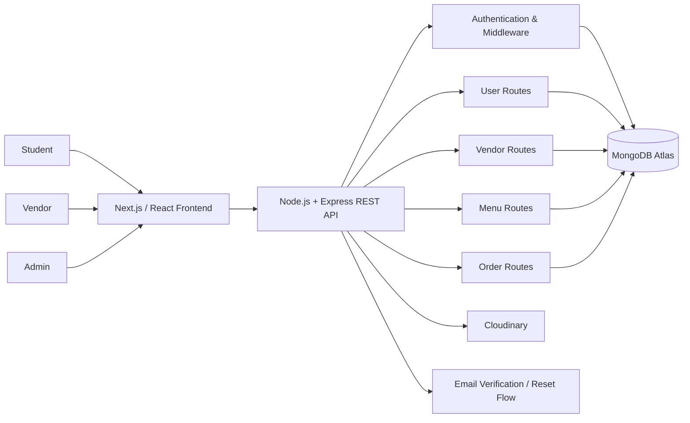
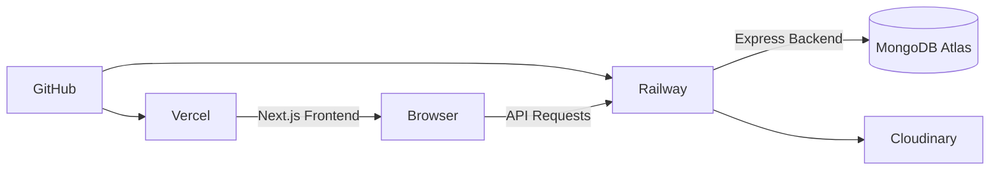

# FTEAT — Campus Food Ordering Platform

A portfolio case study of **FTEAT (Teknik Rekayasa Rasa)**, a multi-role web application built to digitalize ordering at the 7th-floor Engineering canteen at Universitas Tarumanagara.

The project was developed as a collaborative academic final project. I served as the **team leader** and contributed across frontend implementation, responsive behavior, integration, debugging, deployment fixes, and selected backend-connected workflows.

> **Case study note**
>
> This repository is intentionally a portfolio case study rather than a duplicate of the original team repository. The complete source history, branches, pull requests, and collaborative code remain in the original project repository.
>
> **Original team repository:** https://github.com/HannahLarissaHalim/UAS-FrontEnd-Kelompok6

---

## Project Snapshot

- **Context:** Academic final project
- **Period:** 2025
- **Team:** 4-person development team
- **My role:** Team Lead / Full-Stack Contributor
- **Product:** Campus food ordering and vendor-management web platform
- **Frontend:** Next.js, React, Bootstrap
- **Backend:** Node.js, Express.js
- **Database:** MongoDB / MongoDB Atlas
- **Media:** Cloudinary
- **Deployment:** Vercel + Railway
- **Version control:** GitHub

---

## The Problem

The 7th-floor Engineering canteen serves students from several nearby buildings, but ordering was still handled manually.

During busy class breaks, this created practical problems:

- long queues,
- limited time between classes,
- manual order recording,
- difficulty checking menu availability before reaching the canteen,
- and limited digital support for the small food vendors operating there.

FTEAT was designed to reduce those frictions by allowing students to browse and order food online while giving vendors a structured way to manage menus and process incoming orders.

---

## The Product

FTEAT connects three user roles in one workflow:

### Students

Students can:

- register and verify an account,
- log in using their student identity,
- browse available food,
- search and filter menus,
- add items to a cart,
- place an order,
- view payment information,
- send payment confirmation to the vendor,
- and track order status / queue information.

### Vendors

Food vendors can:

- register an account,
- wait for administrator approval,
- log in after approval,
- manage their profile,
- add, edit, and delete menu items,
- update stock availability,
- review incoming orders,
- and verify student payments.

### Administrators

Administrators can:

- log in through a dedicated admin flow,
- review newly registered vendors,
- approve or reject vendor registrations,
- inspect vendor details,
- edit allowed vendor information,
- and remove vendors from the platform.

---

## System Architecture



The backend follows a modular monolithic structure with routes, controllers, models, middleware, and service logic separated by responsibility.

---

## Backend & API Scope

The backend was built with **Node.js and Express.js**, using MongoDB for persistent application data and Cloudinary for media storage.

The project includes API flows for:

### Authentication

- student registration
- login
- current-user retrieval
- email verification
- resend verification email
- forgot-password request
- token-based password reset

### Users

- retrieve users by ID, student number, faculty, major, name, or role
- update nickname
- update profile image
- delete account

### Vendors

- vendor registration and login
- admin vendor listing
- approve vendor
- update vendor
- delete vendor
- vendor self-profile update

### Menus

- list menus
- retrieve menu details
- create menu
- update menu
- delete one or multiple menu items
- update stock state
- retrieve menus by vendor

### Orders

- create orders
- retrieve order details
- retrieve orders by user or vendor
- update order status
- verify payment
- cancel payment verification

---

## My Role & Contributions

I served as **team leader** and contributed across multiple parts of the product rather than staying in only one layer.

My documented contribution includes:

- Built and refined student-facing frontend flows including **Home, Menu, and Cart**
- Worked on vendor-facing **Profile, Orders, and Menu** interfaces
- Implemented and refined responsive behavior across the application
- Participated in frontend-backend integration and database-connected workflows
- Debugged redirect, login, account, vendor, and order-flow issues during integration
- Worked on deployment fixes for the hosted application
- Adjusted cross-origin configuration for local and deployed environments
- Improved account and vendor workflow behavior, including restrictions around vendor bank-account editing
- Fixed order-history image loading and related integrated UI/data behavior
- Worked on email delivery / verification configuration during deployment, including migration away from the original SMTP setup
- Participated in merge and integration work as the project moved from separate feature branches into the final application

The project required repeated integration between UI state, REST endpoints, authentication, persisted data, and deployment configuration — especially during the final delivery phase.

---

## Contribution Evidence

The original repository preserves the collaborative development history.

Selected evidence related to my work:

- **Initial frontend branch integration — PR #14**  
  https://github.com/HannahLarissaHalim/UAS-FrontEnd-Kelompok6/pull/14  
  Student Home/Menu/Cart and Vendor Profile/Orders/Menu work were included in this frontend integration.

- **Deployment / integration fixes — PR #34**  
  https://github.com/HannahLarissaHalim/UAS-FrontEnd-Kelompok6/pull/34

- **Large integration update — PR #35**  
  https://github.com/HannahLarissaHalim/UAS-FrontEnd-Kelompok6/pull/35  
  Included updates spanning application behavior, deployment compatibility, vendor/account workflows, and order-history behavior.

- **Email configuration follow-ups — PR #36 and #37**  
  https://github.com/HannahLarissaHalim/UAS-FrontEnd-Kelompok6/pull/36  
  https://github.com/HannahLarissaHalim/UAS-FrontEnd-Kelompok6/pull/37

- **Email delivery integration — PR #38**  
  https://github.com/HannahLarissaHalim/UAS-FrontEnd-Kelompok6/pull/38

---

## Deployment Architecture

FTEAT was deployed with separate frontend and backend services:



- **Frontend:** Vercel
- **Backend:** Railway
- **Database:** MongoDB Atlas
- **Media:** Cloudinary

The original academic deployment used GitHub-connected deployment so repository updates could trigger rebuilds on the hosting platforms.

> **Deployment status:** The project was deployed during the original academic submission period. The backend deployment may no longer be active because the original hosting period/free service is no longer maintained. The source code, architecture, Git history, and project evidence remain available.

---

## Selected Engineering Challenges

### 1. Connecting three different user roles

The application had to support students, vendors, and administrators without mixing their workflows.

This affected:

- navigation,
- authentication,
- route protection,
- account data,
- menu permissions,
- vendor approval,
- and order visibility.

### 2. Moving from mock UI to database-backed behavior

Early interface work used placeholder data while the screens were being built.

As backend development progressed, menus, users, vendors, and orders had to be connected to real API responses and persisted state.

### 3. Deployment differences between local and hosted environments

A feature that works on localhost can still fail once frontend and backend are hosted on different domains.

The final integration required work around:

- backend URLs,
- environment variables,
- CORS,
- MongoDB connection configuration,
- redirects,
- email delivery,
- and deployment-specific behavior.

### 4. Maintaining an end-to-end order flow

The ordering workflow crosses several parts of the application:

```text
Browse Menu
    ↓
Add to Cart / Buy Now
    ↓
Create Order
    ↓
Payment Information
    ↓
Vendor Payment Verification
    ↓
Order Status / Queue
```

Keeping that flow consistent required frontend state, backend endpoints, persisted order data, and vendor actions to stay aligned.

---

## Project Evidence

### Source Code

- **Original team repository:**  
  https://github.com/HannahLarissaHalim/UAS-FrontEnd-Kelompok6

- **Frontend source:**  
  https://github.com/HannahLarissaHalim/UAS-FrontEnd-Kelompok6/tree/master/fteat_uas_frontend

- **Backend source:**  
  https://github.com/HannahLarissaHalim/UAS-FrontEnd-Kelompok6/tree/master/backend

### Demo

- **Project demo / presentation video:**  
  https://youtu.be/v-htvUScw6M

### Historical Deployment

- **Frontend (Vercel):**  
  https://fteatuntar.vercel.app/home

The frontend URL is included as historical project evidence; some functions may no longer work if the original backend service is inactive.

---

## Technology Stack

| Area | Technology |
| --- | --- |
| Frontend framework | Next.js |
| UI | React, Bootstrap |
| Backend | Node.js, Express.js |
| Database | MongoDB / MongoDB Atlas |
| ODM | Mongoose |
| Authentication | JWT-based application flows |
| Media storage | Cloudinary |
| Email flows | Verification / password-reset email service |
| Frontend deployment | Vercel |
| Backend deployment | Railway |
| Version control | GitHub |

---

## What I Learned

FTEAT was one of the projects that pushed me beyond building isolated pages.

The most valuable lessons came from seeing how many pieces have to work together before a product feels complete:

- translating a real operational problem into application workflows,
- coordinating development across a team,
- designing for multiple user roles,
- connecting frontend interfaces to backend APIs and persisted data,
- understanding how changes in one layer can break another,
- debugging integration rather than only isolated code,
- handling deployment-specific problems,
- and learning that software still needs maintenance after the feature itself is “finished.”

It also made me more interested in the full software lifecycle — not only building a feature, but understanding how it is integrated, deployed, maintained, and used by real people.

---

## Repository Purpose

This repository exists to present FTEAT clearly for **portfolio and technical review**.

It does not duplicate the complete academic source repository. Instead, it summarizes:

- the problem,
- the product,
- the technical architecture,
- my documented contribution,
- deployment decisions,
- engineering challenges,
- and links to the original development evidence.

For complete source code and team history, see the original repository linked above.
